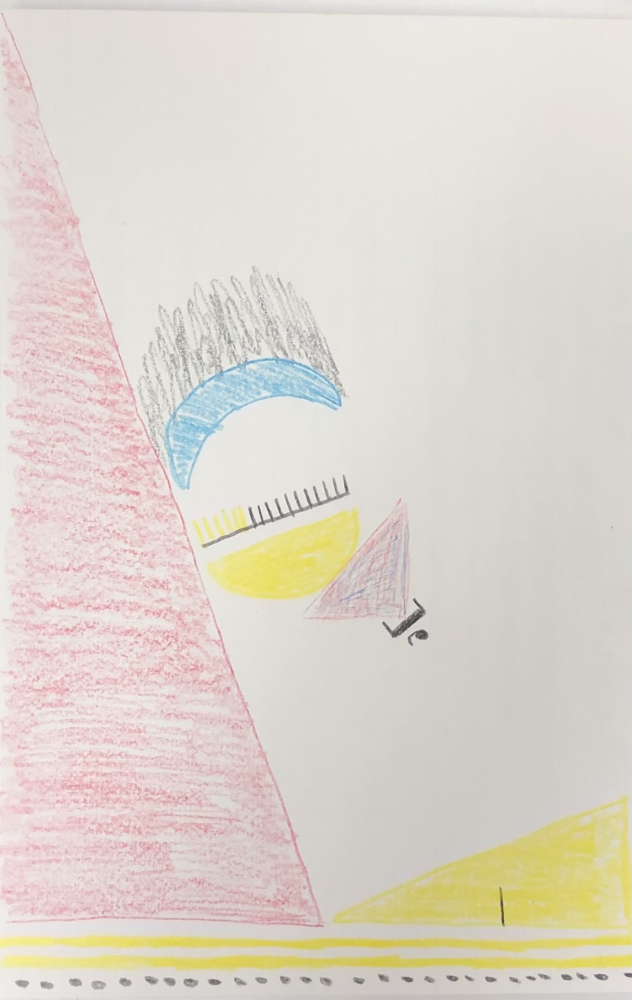

Introduction

# Dustin Marshall

Hi! My name is Dustin Marshall. Before coming to U Chicago, I worked at a research center at UC Berkeley that ran randomized controlled trials on poverty interventions in low- and middle-income countries (LMICs). Over the summer, I worked for the Rockefeller Foundation's Data Team. I'm currently co-leading the International Development Policy Association (IDPA) and am a research assistant at the Development Innovation Lab (DIL). After MSCAPP, I'd still like work on poverty-focused interventions in LMICs, but as data scientist or engineer.